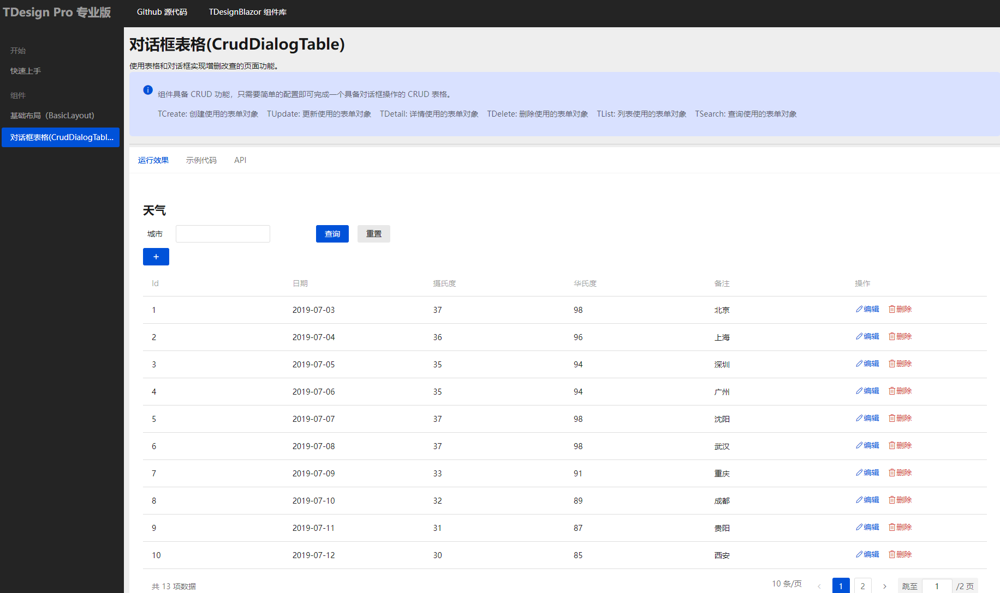
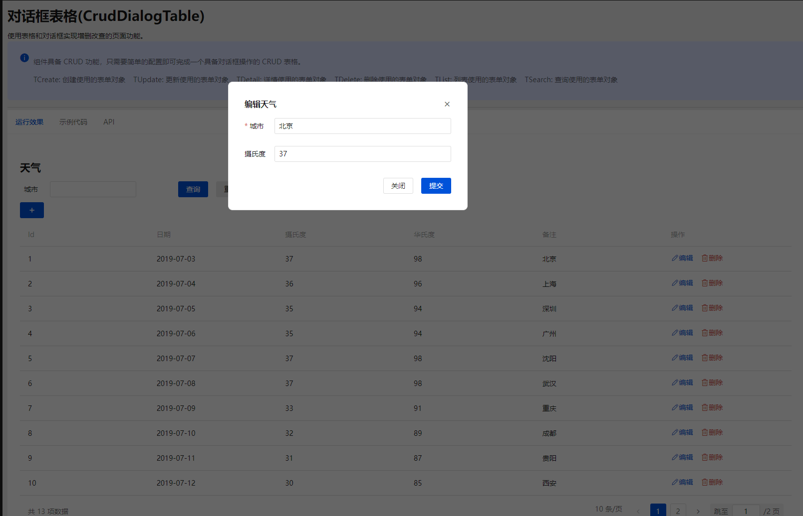

# TDesignBlazor.Pro
基于 TDesignBlazor 的专业组件库，进一步提供比较复杂且适应应用开发的完整组件封装。

基础功能的[**TDesignBlazor 组件库**](https://github.com/tdesign-blazor/TDesignBlazor)


## 示例




```cs
<CrudDialogTable TCreate="WeatherForecast"
                    TUpdate="WeatherForecast"
                    TList="WeatherForecast"
                    TSearch="WeatherForecast"
                    TDetail="WeatherForecast"
                    PageTitle="天气"
                    ListDataSourceProvider="GetData"
                    DetailDataSourceProvider="Get"
                    OnFormCreating="Create"
                    OnFormUpdating="Update"
                    OnConfirmDeleting="Delete"
                    Key="m=>m.Id">
    <SearchFormContent>
        <TFormItem For="()=>context.TemperatureC" Label="城市">
            <TInputText @bind-Value="context.Summary" />
        </TFormItem>
    </SearchFormContent>
    <CreateFormContent>
        <TFormItem For="()=>context.Summary" Label="城市">
            <TInputText @bind-Value="context.Summary" />
        </TFormItem>
        <TFormItem For="()=>context.TemperatureC" Label="摄氏度">
            <TInputText @bind-Value="context.TemperatureC" />
        </TFormItem>
    </CreateFormContent>
    <UpdateFormContent>
        <TFormItem For="()=>context.Summary" Label="城市">
            <TInputText @bind-Value="context.Summary" />
        </TFormItem>
        <TFormItem For="()=>context.TemperatureC" Label="摄氏度">
            <TInputText @bind-Value="context.TemperatureC" />
        </TFormItem>
    </UpdateFormContent>
    <TableColumnContent>
        <TTableFieldColumn Header="Id" TItem="WeatherForecast" TField="int" Field="p=>p.Id" />
        <TTableFieldColumn Header="日期" TItem="WeatherForecast" TField="DateOnly" Field="p=>p.Date" Format="yyyy-MM-dd" />
        <TTableFieldColumn Header="摄氏度" TItem="WeatherForecast" TField="int" Field="p=>p.TemperatureC" />
        <TTableFieldColumn Header="华氏度" TItem="WeatherForecast" TField="int" Field="p=>p.TemperatureF" />
        <TTableFieldColumn Header="备注" TItem="WeatherForecast" TField="string" Field="p=>p.Summary" />
    </TableColumnContent>
</CrudDialogTable>
```

## 快速上手
```cmd
Install-Package TDesignBlazor.Pro
```

```cs
builder.Services.AddTDesignPro();

//or

builder.Services.AddTDesignPro(configure => {
    configure.AppName = ""系统名称"";
    //..其他配置项
});
```
## 行为准则
本项目采用了贡献者契约定义的行为准则，以澄清我们社区的预期行为。请仔细阅读[行为准则](./CodeOfConduct.md)。

## 许可证（License）
[](https://github.com/tdesign-blazor/TDesignBlazor.Pro/blob/main/LICENSE.md)